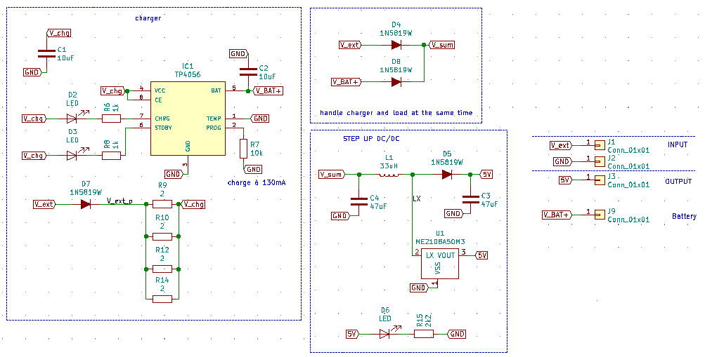

# 02_Batt_Alim_4p

Module Batt_alim avec 4 pins. /

Le module Batt_Alim permet de gérer la charge d'une batterie Lipo constituée d'une seule cellule (4.2V) à partir d'une source de type 5V USB.
Il permet aussi de récupérer cette tension batterie variable et de reconstituer un 5V constant grâce à un DCDC.

La licence est celle du CERN Open Hardware Licence version 2; CERN-OHL-P ; permissive.
Le fichier de cette license est présent dans le répertoire: cern_ohl_p_v2.txt

# Schéma et fonctionnement

Ci-joint le schéma de la version de 2021_02_23 // Here schematic of version 2021_02_23:

Le module fonctionne de la façon suivante:
Il faut l'alimenter avec une tension 5V +-5% (typiquement celle de l'USB classique) sur la pin Vext. (Ne pas oublier GND bien sûr).

Il faut brancher la batterie Lipo sur V_bat+ et GND. La batterie Lipo doit être constituée d'une seule cellule, qui doit être chargée à 4.2V, présente une tension de 3.7V typique, et dont la tension de mise en protection est de 3V. La résistance R7 de 10kOhms permet de régler la puce TP4056 sur un courant de charge de 130mA. La batterie Lipo doit donc avoir une capacité d'au moins 2*130mAh, soit 260mAh au minimum. Plus d'information sur www.tp4056.com.

La sortie 5V est une tension issue du DCDC.

La LED D6 indique la présence de 5V à la sortie du DCDC, avec "5V ON" comme étiquette.

Les LEDs D2 et D3 indiquent respectivement la charge et le mode standby du TP4056. Les étiquettes sont "CHG" et "STBY".
